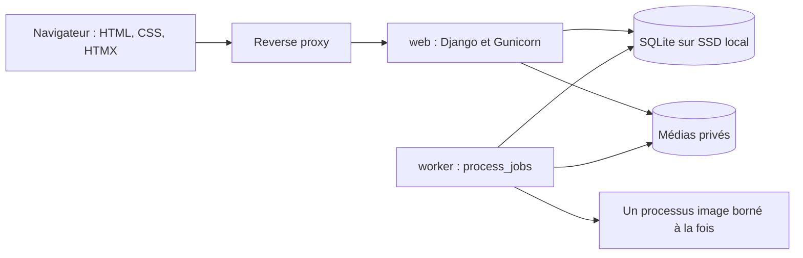

# Ma Pixelothèque — architecture implémentée

État du code au 28 septembre 2026. Ce document décrit les composants présents et leurs limites ; les résultats de tests et la mise en service sont rapportés séparément. Les commandes d’exploitation figurent dans [deployment.md](deployment.md), [backup-restore.md](backup-restore.md) et [reverse-proxy/README.md](reverse-proxy/README.md).

## 1. Architecture technique

Un monolithe Django, avec la même image Docker pour le web et un worker distinct :



| Composant | Implémentation |
|---|---|
| Backend | Python 3.13 dans Docker, Django 5.2 LTS ; versions exactes dans `Dockerfile` et `requirements.txt`. |
| Pages | Django Templates et formulaires Django ; HTMX pour les favoris, JavaScript léger pour upload, carte et navigation. |
| Interface | CSS statique, thèmes clair/sombre/système, ressources HTMX et Leaflet locales avec licences ; aucun build npm. |
| Base | SQLite et ORM Django ; journal standard, WAL non activé. |
| Images | Pillow ; décodage complet, EXIF et dérivés exécutés dans un processus enfant du worker. |
| Web | Gunicorn, un processus et deux threads ; WhiteNoise pour les fichiers statiques de l’interface uniquement. |
| Tâches | Table `ProcessingJob`, réservation conditionnelle et bail expirant. Aucun Redis, Celery ou courtier de messages. |
| Carte | Leaflet ; regroupement géographique SQL après filtrage des permissions. |
| Administration | Tableau de suivi et Django Admin réservé aux superutilisateurs. |

La cible initiale est environ 5 000 photos, avec croissance attendue, sur Raspberry Pi 5 de 4 Go. Les limites Compose sont initialement de 512 Mio et 1 CPU pour le web, 896 Mio et 0,75 CPU pour le worker. Le débit et la mémoire doivent être mesurés sur les photos et le matériel réels.

## 2. Organisation du dépôt

```text
ma-pixelotheque/
├── manage.py
├── pixelotheque/         # Configuration, URL racine, WSGI, réglages de tests
├── apps/
│   ├── accounts/         # Utilisateurs, authentification, thèmes, limites de connexion
│   ├── library/          # Albums, photos, permissions, timeline, recherche, carte, favoris
│   ├── processing/       # Upload, stockage privé, jobs, pipeline et worker
│   ├── sharing/          # Liens privés et pages limitées à un album
│   └── core/             # Réglages, suivi, healthz, réponses privées et erreurs
├── templates/
├── static/               # CSS, JavaScript et bibliothèques locales
├── tests/                # Tests de permissions, fonctionnalités, traitements et volume
├── scripts/              # Initialisation privée, Compose, healthcheck, sauvegarde
├── docs/
├── Dockerfile
├── docker-compose.yml
├── .env.example
├── requirements.txt
└── LICENSE               # MIT
```

Les bases, médias, secrets et sauvegardes restent hors du dépôt et du contexte de build. `.dockerignore` utilise une liste positive des fichiers applicatifs.

## 3. Modèle de données

| Modèle | Données essentielles |
|---|---|
| `User(AbstractUser)` | Rôle `family` ou `guest`, thème ; invité par défaut, administration par superutilisateur Django. |
| `Album` | UUID, propriétaire, titre, description, visibilité `family/private/restricted`, contribution familiale et dates. |
| `AlbumPermission` | Album, utilisateur, droit de contribuer ; paire unique. |
| `MediaItem` | UUID, uploader, type photo, titre, description, nom original, clés privées des fichiers, poids, SHA-256, états de validation/dérivés, dimensions, dates, appareil, GPS et EXIF sélectionné. |
| `AlbumMedia` | Association album/photo, date d’ajout ; paire unique. |
| `Tag` | Nom et valeur Unicode normalisée unique ; association multiple aux photos. |
| `Favorite` | Utilisateur/photo ; paire unique. |
| `SharedLink` | Album, créateur, empreinte du token, état, expiration, téléchargement, révocation, dates et compteur d’ouvertures. |
| `ProcessingJob` | Photo, type `inspect/render`, état, tentatives, disponibilité, jeton de réservation, bail, dates et erreur nettoyée. |
| `AppSetting` | Une ligne à champs typés : génération, édition/partage familiaux, dimensions/qualité, limites d’upload/pixels et pause du worker. |

La date de classement suit l’ordre correction manuelle, date EXIF valide, date d’upload. Une régénération conserve la correction et les informations manuelles. Le fuseau EXIF est utilisé lorsqu’il existe ; sinon le fuseau de l’instance, `Europe/Paris` par défaut, s’applique. L’extraction EXIF accepte les dates entre 1900 et 2100. Les formulaires de dates bornent les années extrêmes pour éviter les débordements lors des conversions de fuseau.

Latitude et longitude sont absentes ensemble ou présentes dans leurs bornes. La base accepte seulement le type `photo`. Les index couvrent notamment date/UUID, statut, appareil, relations d’accès et d’appartenance, empreinte unique des liens, disponibilité et bail des jobs. Un seul job actif peut exister par photo et type.

## 4. Permissions et organisation des albums

`Album.objects.visible_to(user)` et `MediaItem.objects.visible_to(user)` filtrent les droits dans SQL, avant pagination, compteurs, couvertures et agrégats. Des sous-requêtes `EXISTS` évitent de compter plusieurs fois une photo présente dans plusieurs albums.

| Action | Admin actif | Famille active | Invité actif | Visiteur avec lien |
|---|---|---|---|---|
| Lire des albums | Tous | Familiaux, ses albums, restreints autorisés | Explicitement autorisés | Album du lien |
| Timeline, recherche, carte | Oui | Photos autorisées | Non | Non |
| Créer un album | Oui | Oui | Non | Non |
| Uploader | Oui | Albums où la contribution est autorisée | Non | Non |
| Modifier une photo | Photos accessibles | Ses photos accessibles si le réglage le permet | Non | Non |
| Gérer visibilité et membres | Tous | Ses albums | Non | Non |
| Favoris | Personnels | Personnels | Personnels sur photos accessibles | Non |
| Créer un partage | Oui | Ses albums si le réglage le permet | Non | Non |
| Télécharger un original | Photos validées | Photos validées accessibles | Non | Si autorisé par le lien |

Règles appliquées :

- Un album familial est visible par toute la famille ; la contribution familiale est activée par défaut. Les invités doivent être explicitement ajoutés.
- Un album privé reste réservé à son propriétaire et aux admins, même si des anciennes lignes de permission existent.
- Un album restreint est visible par son propriétaire, les admins et les membres choisis. La contribution requiert un membre famille explicitement autorisé.
- Un propriétaire rétrogradé en invité conserve la lecture de ses propres albums, mais perd gestion et contribution. Désactiver le compte retire aussi cette lecture.
- Une photo doit appartenir à un album accessible. L’uploader ne bénéficie pas d’un accès indépendant des albums. Une photo en attente ou en erreur n’est visible qu’à son uploader ou aux admins, toujours sous réserve d’accès à un album.
- Les autres albums d’une photo, couvertures, nombres et résultats ne révèlent pas les albums cachés. Les suggestions d’uploader dans la recherche sont limitées aux photos autorisées.
- L’invitation de membres ne présente que les noms des comptes actifs ; les invités n’accèdent pas à cette interface.
- Les fichiers exigent toujours `status=ready`, même pour l’admin ou l’uploader. Aucun traitement image ne s’exécute pour répondre à une consultation.
- Un favori ne prolonge pas un accès révoqué.

Le formulaire de photo permet plusieurs albums. `Album.objects.uploadable_to(user)` limite les destinations à celles où l’acteur peut contribuer. Les associations existantes hors de ces droits restent inchangées, y compris celles d’albums cachés. Les permissions sont relues dans la transaction avant modification et une photo doit conserver au moins une association. Ajouter un album peut élargir l’audience ; l’interface le précise.

La suppression d’un album est refusée si elle retire la dernière association d’une photo, y compris pour une suppression ORM groupée. La suppression groupée d’albums dans Django Admin et la suppression brute de photos y sont désactivées. Un service de suppression définitive coordonnant base et fichiers n’est pas encore livré.

## 5. Routes et parcours

Les routes sont relatives au préfixe configuré : avec `APP_BASE_PATH=/ma-pixelotheque`, `/albums/` devient `/ma-pixelotheque/albums/`.

| Route | Fonction |
|---|---|
| `/` | Timeline pour famille/admin, albums pour les invités. |
| `/accounts/login/`, `/accounts/logout/`, `/accounts/account/` | Connexion, déconnexion par POST, mot de passe et préférences. |
| `/albums/`, `/albums/new/` | Liste paginée et création. |
| `/albums/<uuid>/`, `/albums/<uuid>/edit/` | Photos et gestion de l’album. |
| `/upload/` | Upload multiple, choix ou création d’album. |
| `/photos/` | Timeline paginée. |
| `/photos/year/<année>/` | Sélection annuelle. |
| `/photos/year/<année>/<mois>/` | Sélection mensuelle. |
| `/photos/year/<année>/<mois>/<jour>/` | Sélection quotidienne. |
| `/photos/<uuid>/`, `/photos/<uuid>/edit/` | Lightbox et métadonnées/albums. |
| `/photos/<uuid>/favorite/`, `/favorites/` | Mutation POST et favoris personnels. |
| `/search/` | Recherche et filtres. |
| `/map/`, `/map/data/`, `/map/photos/` | Carte, cellules agrégées et photos d’une zone. |
| `/files/<uuid>/<variant>/` | Fichier privé : `thumbnail`, `preview` ou `original`. |
| `/s/manage/<uuid>/` | Gestion des liens d’un album. |
| `/s/<token>/` et sous-routes photo/fichier | Consultation limitée au partage. |
| `/manage/`, `/admin/` | Suivi et administration. |
| `/healthz` | État HTTP et requête DB légère sans détails sensibles. |

La lightbox conserve son contexte : album, recherche, période, favoris ou zone cartographique. Précédent/suivant sont des requêtes bornées selon `(date, UUID)` ; aucune liste complète d’identifiants n’est transmise au navigateur. Les liens et formulaires classiques restent fonctionnels ; HTMX et navigation clavier améliorent ce parcours.

## 6. Pagination, timeline, recherche et carte

La pagination livrée est `LIMIT/OFFSET`, avec ordre déterministe : 24 albums ou 60 photos par page. Django calcule un total autorisé. Il ne s’agit pas d’une pagination par curseur ; les pages très éloignées devront être mesurées si la collection augmente fortement.

Les sélections de période sont déterministes :

- année : au maximum 12 photos, une par mois occupé ;
- mois : au maximum 31 photos, une par jour occupé ;
- jour : au maximum 24 photos, une par intervalle horaire occupé ;
- « Toutes les photos de cette période » : pages de 60.

Chaque intervalle prend la première photo selon `(date, UUID)` dans le périmètre autorisé. Il n’y a ni tri aléatoire complet ni chargement global. La sélection reste stable tant que dates, photos et droits ne changent pas ; elle représente la répartition temporelle, pas une évaluation esthétique. Une vue de synthèse effectue au plus une requête par intervalle. Les miniatures préproduites sont chargées à la demande par le navigateur.

Les couvertures et nombres d’images des albums sont calculés par sous-requêtes autorisées, sans requête distincte par carte. Une couverture exige une photo validée et une miniature disponible.

**Recherche.** Titre, description, nom d’un album visible et tags, puis filtres de dates, uploader, appareil, GPS et favoris. Les tags sont normalisés Unicode. Titres et descriptions utilisent les opérateurs textuels ordinaires de SQLite : pas d’analyse linguistique complète des accents ou de la casse Unicode. Une recherche contenant un mot peut parcourir de nombreuses lignes malgré les index des autres filtres. FTS5 reste une évolution non livrée.

**Carte.** Le navigateur transmet zone visible et zoom. Le serveur filtre les photos validées autorisées, applique la zone puis regroupe les points dans une grille de 15 × 15 cellules. Les frontières peuvent produire jusqu’à 16 × 16 groupes, toujours sous le plafond de 300. La réponse contient centre moyen, nombre et bornes de chaque groupe. L’antiméridien est pris en compte. Le client n’obtient jamais tous les points pour construire lui-même les clusters ; les photos d’une zone sont paginées.

Une vue mondiale peut néanmoins parcourir toutes les lignes GPS autorisées en SQL. Borne de sortie et travail SQL constant sont deux notions distinctes. Les tests utilisent 5 000 lignes pour vérifier pages, nombres de requêtes, sélections et plafond cartographique ; ils ne constituent pas une certification de débit sur le Pi.

Le fond de carte externe est configurable. Les tuiles OpenStreetMap par défaut ne sont demandées que sur la page Carte. Le fournisseur reçoit l’adresse IP et la zone consultée, pas les photos. La page transmet seulement l’origine comme référent externe. Les pages de partage ne chargent aucune ressource tierce.

## 7. Upload et worker

L’upload accepte JPEG, PNG et WebP fixes. L’extension est confrontée au format identifié par Pillow ; le MIME du navigateur ne fait pas foi. Le serveur limite les octets reçus, écrit en flux dans un répertoire temporaire privé et contrôle dimensions et animation à l’admission. Le décodage intégral reste différé.

Les originaux sont conservés intacts sous une clé UUID indépendante du nom envoyé. La photo et l’association à l’album sont enregistrées avec un job `inspect`. Les fichiers restent inaccessibles jusqu’à validation complète.

Réglages initiaux : 30 Mio par photo, 40 millions de pixels, miniature de 480 px, preview de 2048 px, WebP qualité 82. Des plafonds supérieurs du code limitent les réglages administrateur. Les dérivés appliquent l’orientation puis sont réencodés sans EXIF, GPS, XMP ou commentaires. L’absence de miniature produit un état explicite, jamais un téléchargement automatique de l’original dans la grille.

`python manage.py process_jobs` effectue les opérations suivantes :

1. Prendre un verrou de fichier sur le volume local ; un second worker utilisant ce verrou ne traite pas les images simultanément.
2. Récupérer les baux expirés et sélectionner un job disponible.
3. Réserver le job par mise à jour conditionnelle avec jeton aléatoire et bail de 60 secondes. Aucun verrou de ligne `select_for_update()` n’est supposé avec SQLite.
4. Démarrer un seul enfant image, borné en mémoire et CPU ; le superviseur impose une durée maximale et renouvelle le bail.
5. Publier métadonnées ou références des dérivés dans une transaction courte vérifiant encore jeton et bail. Aucun décodage ne se déroule sous transaction SQL.
6. Terminer le job ou enregistrer une erreur nettoyée. Les erreurs transitoires disposent de reprises espacées, avec au maximum trois tentatives.

`inspect` valide et extrait les métadonnées ; `render` produit les dérivés. Désactiver la génération automatique ne désactive pas validation/EXIF : le job de génération devient `skipped`. Une régénération ratée conserve les dérivés déjà publiés.

Les actions admin relancent les erreurs ou régénèrent une sélection de photos/albums, y compris la sélection complète. La file est alimentée par lots de 100 ; aucune image n’est produite pendant ces requêtes web. La pause empêche le démarrage de nouveaux traitements. Le plafond simultané du MVP est un traitement ; le worker n’expose pas de port HTTP.

## 8. Stockage, sauvegarde et liens privés

`scripts/init_env.py` prépare un dossier privé :

```text
dossier-prive/
├── app.env                # Secret et paramètres, mode 600
├── data/                  # SQLite, journaux et verrou worker
├── media/
│   ├── originals/
│   ├── thumbnails/
│   ├── previews/
│   └── temp/
└── backups/
```

Les dossiers sont en mode 700. Le script refuse une configuration existante, le dépôt et les documentroots connus/déclarés. Les chemins hôtes sont configurables ; les volumes internes sont `/data` et `/media`. Le worker monte les originaux en lecture seule. Les données doivent être sur un disque local adapté à SQLite.

Après autorisation par la vue, `processing.storage.media_response` contrôle la variante, confine le chemin, refuse les liens symboliques et renvoie `FileResponse`. Les originaux sont des téléchargements avec type explicite. Aucun alias HTTP ne publie les médias directement. Pages dynamiques et médias utilisent des réponses privées non stockables par les caches. Révoquer un droit bloque les futurs accès réseau, sans retirer les copies déjà sauvegardées.

**Sauvegarde.** `scripts/backup.py` suppose l’arrêt explicite des services écrivains. Il exporte une base autonome via l’API SQLite, vérifie cette copie, copie les médias et écrit le manifeste en dernier. Le secret est exclu et doit être sauvegardé séparément. La destination doit être hors des volumes source. Une restauration cohérente base/médias/version applicative doit être vérifiée sur l’installation réelle.

**Partage.** Le token contient 32 octets aléatoires. Seule son empreinte SHA-256 est stockée ; l’URL complète est affichée une fois à la création. Chaque requête vérifie activité, expiration, révocation et appartenance actuelle de la photo à l’album. Une session admin ne peut pas élargir le périmètre d’un lien.

Les pages publiques ont une présentation autonome, une politique de sécurité restrictive, aucun script ou média tiers et `Referrer-Policy: no-referrer`. Le compteur mesure les ouvertures des pages d’album, pas les visiteurs uniques. Interdire le téléchargement interdit l’original ; une preview affichée reste enregistrable. Les originaux autorisés conservent leurs EXIF, dont potentiellement le GPS.

## 9. Sécurité et déploiement

- `DEBUG=False`, clé privée via environnement, hôtes explicites, CSRF et authentification Django ; aucune inscription publique.
- Mutations par POST protégés. L’upload installe ses limites avant lecture multipart, puis applique explicitement CSRF.
- Limitation des tentatives sur connexions familiale et admin. L’adresse retenue est `REMOTE_ADDR`, sans confiance dans un `X-Forwarded-For` arbitraire ; derrière un proxy, le plafond par adresse peut concerner plusieurs personnes.
- Cookies sécurisés et redirections HTTPS activables une fois le frontal contrôlé opérationnel. Ce frontal doit remplacer les en-têtes auxquels Django fait confiance.
- Conteneurs non root, système de fichiers en lecture seule, volumes privés, temporaire borné, capacités Linux retirées et limites de ressources.
- Port web lié à loopback en mode autonome. L’override Apache utilise le réseau existant et l’alias `pixelotheque-web`, avec suppression du port publié. Le worker ne rejoint pas le réseau Apache.
- Le proxy retire `APP_BASE_PATH` ; Django le réintroduit pour URL, statiques, cookies et redirections. Des exemples Apache, Nginx, Caddy et Traefik sont fournis.
- Migrations explicites avant démarrage des services ; statiques collectés au build. Aucune compilation frontend npm.

Le checkout du homelab est sous une arborescence `www`. Le guide de raccordement distingue la route proxifiée et le refus d’accès au répertoire source : code, Git, `.env`, bases et sauvegardes ne doivent pas devenir des fichiers servis par Apache. La présence de ces exemples ne modifie pas le frontal existant.

## 10. Validation et limites

Les tests couvrent permissions album/photo, fichiers et compteurs, perte d’accès, reclassement, contextes de lightbox, dates corrigées, recherche, favoris, carte, liens expirés/révoqués, uploads invalides, reprise du worker, dérivés sans EXIF, pagination et jeux de 5 000 photos. Les tests d’initialisation utilisent seulement des dossiers temporaires et la bibliothèque standard. Les résultats d’exécution et mesures matérielles sont rapportés séparément.

Limites de la version :

- vidéos, synchronisation mobile, scan/import automatique, import Piwigo/Google Photos et fonctionnalités IA absents ;
- SQLite uniquement dans la configuration livrée ; PostgreSQL, FTS5 et WAL à développer ou valider séparément ;
- pagination par offset, recherche simple et agrégations SQL à mesurer à plus grande échelle ;
- un seul hôte et un seul traitement image simultané ;
- pas de suppression définitive coordonnée base/fichiers, de déduplication automatique ou de nettoyage automatique des anciennes générations ;
- sauvegarde avec arrêt des écritures, sans réplication distante automatique ;
- fond de carte externe configurable, sans serveur de tuiles local ;
- exposition HTTPS, sauvegarde hors machine et restauration opérationnelle à valider dans l’environnement d’exploitation ; le raccordement Apache LAN est décrit dans le [bilan de validation](validation.md).

Les évolutions doivent conserver permissions avant agrégation, validation avant publication des fichiers, limites du worker et absence de compilation frontend obligatoire.

## 11. Historique du plan validé

Le développement suit les étapes de la proposition initiale. Ce tableau conserve leur ordre ; « implémenté » décrit le code, sans confondre livraison et validation sur l’installation réelle.

| Étape initiale | État du code |
|---|---|
| 1. Socle | Django, réglages, Compose, statique, préfixe et healthz implémentés. |
| 2. Comptes et albums | Rôles, connexion, visibilité et gestion des membres implémentés. |
| 3. Upload et traitements | Upload multiple, stockage, EXIF, jobs, dérivés et worker implémentés. |
| 4. Consultation | Timeline, sélections par période, grilles et lightbox implémentées. |
| 5. Organisation | Métadonnées, tags, correction de date, reclassement, recherche et favoris implémentés. |
| 6. Partage et carte | Liens révocables, pages autonomes et agrégats Leaflet implémentés. |
| 7. Exploitation | Réglages, régénération, scripts de sauvegarde et guides présents ; raccordement réel, mesures Pi, HTTPS et restauration opérationnelle à valider. |
